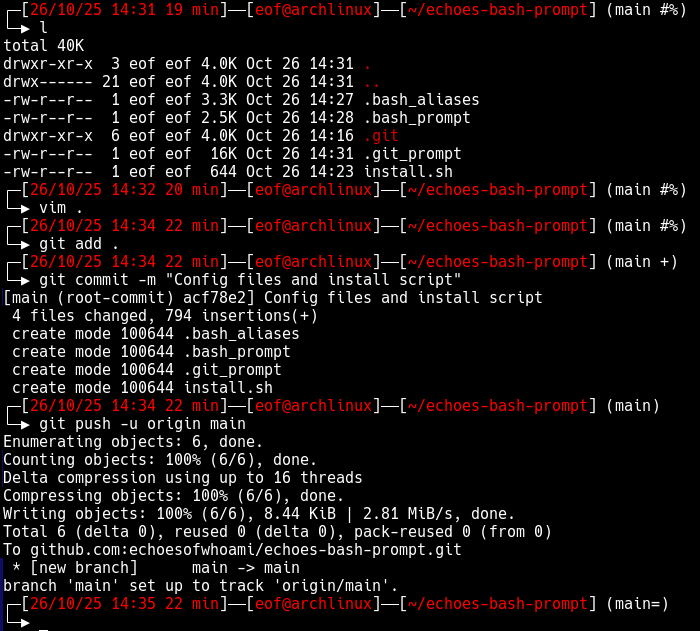

# 🐚 Echoes Git/Bash Prompt Setup

This repo’s for the htb folks that ask for it.

Contains a install.sh script that can be executed without looking at it and it will replace some of your acutal stuff so read things.

It contains some useful aliases for htb machines like: connectvpn, stopvpn, htbip, addhost (to /etc/hosts) etc.

The git prompt will track the current directory's git branch status and display some symbols like in this image:



## Install
```bash
git clone https://github.com/echoesofwhoami/echoes-bash-prompt.git
cd echoes-bash-prompt
sh install.sh
source ~/.bashrc
rm -rf echoes-bash-prompt
```

## FAQ
- Q: Can I install this manually?
- A: It is the recommended way, only execute the install.sh script if you know what id does and you're ok with it.

- Q: I installed this with install.sh and lost my aliases how do I recover them
- A: Git gut

- Q: Where do I find your bash prompt config?
- A: Yes

## Credits
Thanks to myself for making this and adding a fork of the git-prompt.
If you like it smash the respect button here https://app.hackthebox.com/users/2423666
